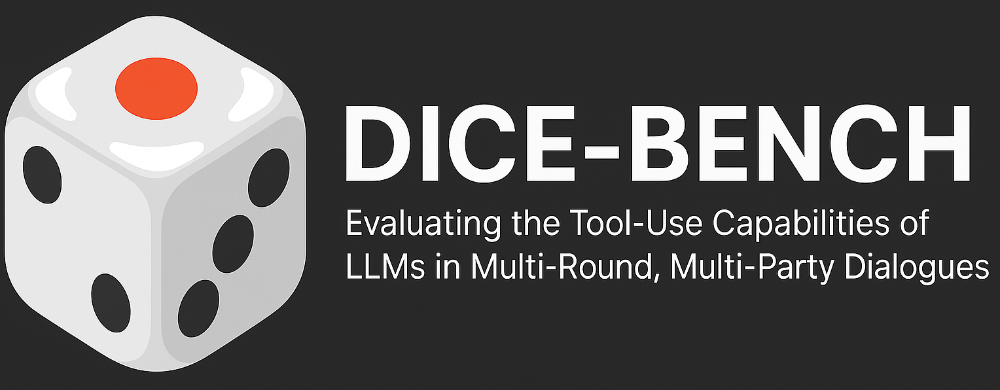
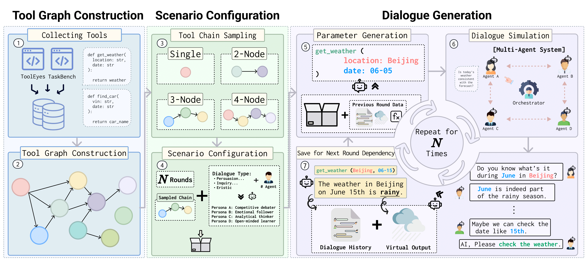
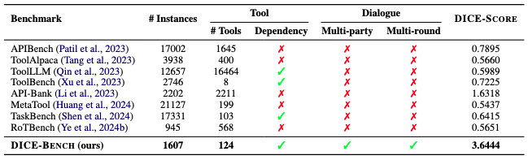

<p align="center">
  
</p>

# DICE-BENCH: Evaluating the Tool-Use Capabilities of Large Language Models in Multi-Round, Multi-Party Dialogues

<p align="center">
  <a href="https://arxiv.org/abs/TBD" target="_blank"></a>
  <a href="https://snuhcc.github.io/DICE-Bench/" target="_blank"></a>
  <a href="https://huggingface.co/datasets/OfficerChul/DICE-BENCH" target="_blank"></a>
  <a href="https://github.com/snuhcc/DICE-Bench" target="_blank"></a>
</p>

> **TBD**: Add paper, Add arXiv, Chang Citation

---

### ✨ News (DICE-BENCH)

* **06/28/2025** - Dataset released on [HuggingFace](https://huggingface.co/datasets/OfficerChul/DICE-BENCH)!
* **06/25/2025** - Initial public release of **DICE-BENCH** including data generation, scoring utilities, and vLLM inference scripts.
* **05/16/2025** - Our Paper DICE-BENCH is accepted to [ACL 2025. See you in Vienna, Austria!](https://2025.aclweb.org/)

---

## 📖 Overview

<p align="center">
  
</p>

**DICE-BENCH** is a benchmark that tests how well large language models can call external functions in realistic group-chat scenarios.

Key points at a glance:
- DICE-BENCH synthesizes real group chats with a condition of four rounds and two to four speakers.
- The released dataset contains 1,607 dialogues, and 124 distinct tools.
- DICE-SCORE quantifies how difficult the given inputs are by quantifying dispersion of tool-clues throughout the input. Higher scores means the input is difficult.
- Even GPT-4o averages only about 64 percent exact match, with performance falling as rounds or participants increase.
- As the first benchmark to combine multi-round multi-party dialogue and inter-tool dependencies, DICE-BENCH provides fully open code, data, and pipeline.

<p align="center">
  
</p>

---

## 📂 Directory Layout


| Path | Description |
|------|-------------|
| `src/` | Core Python package (agents, prompts, utils, graphs, inference) |
| `data/` | Pre-generated sample datasets (`round_*.json`) |
| `scripts/` | Bash helpers to generate data & run inference |
| `outputs/` | Generated outputs (`all_rounds`, `selected_round`, `inf_vllm`). **Note:** the output files committed here are *demo-sized* samples only. Please visit the Hugging Face repository for the full dataset. |

---

## 🛠️ Core Scripts

| Script | Purpose | Key CLI flags / variables |
|--------|---------|---------------------------|
| `scripts/gen_all_round.sh` | Quickly generate a **small** dataset across rounds 1–4, multiple agent numbers & domains. | `AGENT_NUM_LIST`, `DOMAIN_LIST`, `ROUND_LIST`, `DATASET_NUM`, outputs to `outputs/all_rounds/round_<n>.json` |
| `scripts/gen_selected_round.sh` | Generate **many** samples for one specific round (`SELECTED_ROUND`). | `DATASET_NUM`, `SELECTED_ROUND`, outputs to `outputs/selected_round/round_<n>.json` |
| `scripts/inf_vllm.sh` | Run **vLLM** inference over generated dialogues. | `MODEL_NAME`, `FUNCTION_DOCS`, `MAX_TOKENS`, results in `outputs/inf_vllm/<model>/` |

All scripts rely on `uv` to launch python modules reproducibly (`uv run ...`). Feel free to edit variables at the top of each file.

---

## 📁 Data Directory Explained

The repository ships with a **sample** dataset under `data/sample/` so you can explore the JSON structure without running generation.

```
 data/
   ├── round_1.json          # full dataset (available at Huggingface)
   ├── round_2.json
   ├── ...
   └── sample/
        ├── round_1.json     # tiny subset (≈2 dialogues) for quick inspection
        └── ...
```

* `round_<n>.json` – gold dialogues used for evaluation (can be regenerated).  
* `sample/round_<n>.json` – miniature versions bundled with git to keep the repo lightweight.

The **tool graph** and **function docs** used during generation live in `src/graph/tool_graph.json` and `src/graph/tool_docs.json` respectively.

---

## 🏃‍♂️ Quick Start

### 1. Environment (🛠 with **uv**)

`uv` is a super-fast Rust-based package manager & virtual-env tool that fully understands **pyproject.toml**.  
If you do not have it yet:

```bash
curl -Ls https://astral.sh/uv/install.sh | bash   # installs to ~/.cargo/bin/uv
```

Create the environment and install all dependencies with a single command:

```bash
# From repository root
uv init dicebench   # creates .venv and installs deps from pyproject.toml
```

Need an extra library? Just do:

```bash
uv add <package-name>
```

*Fallback:* you can still use plain `pip`, but all examples below assume **uv**.

### 2. Generate Synthetic Dialogues

```bash
cd scripts
./gen_all_round.sh       # all rounds, small size (≈ a few minutes)
./gen_selected_round.sh  # generate many samples for a single round
```

Outputs are written under `outputs/all_rounds/` and `outputs/selected_round/` respectively.

### 3. Run vLLM Inference

```bash
cd scripts
./inf_vllm.sh            # requires CUDA + vLLM installation
```

Results will appear in `outputs/inf_vllm/<model_name>/`.

---

## 🔄 Experiment Steps

1. **Prepare Data** - use the *generation* scripts above or supply your own tool-graph JSON.
2. **Fine-tune / Inference** - leverage `src/inference/inference_vllm.py` for fast decoding.
3. **Evaluate** - employ `src/get_dice_score.py` to calculate the DICE metric.

Detailed configs (model path, dataset size, TP degree, etc.) can be edited directly in each bash script or via CLI flags.

---

## 📜 Citation(TBD)

```bibtex
@inproceedings{jang2025dicebench,
  title     = {DICE{-}BENCH: Evaluating the Tool{-}Use Capabilities of Large Language Models in Multi{-}Round, Multi{-}Party Dialogues},
  author    = {Jang, Kyochul and Lee, Donghyeon and Kim, Kyusik and Heo, Dongseok and Lee, Taewhoo and Kim, Woojeong and Suh, Bongwon},
  booktitle = {Findings of the Association for Computational Linguistics: ACL 2025},
  year      = {2025},
  address   = {Vienna, Austria},
  url       = {https://github.com/snuhcc/DICE-Bench},
  note      = {Preprint available on arXiv}
}
```

---

## 🤝 Contact & Contributing

Questions / ideas? Open an issue or email **kyochul@snu.ac.kr**. Pull-requests are welcome!

Please visit to [kyochul\[dot\]com](https://www.kyochul.com/) for more information about the first author!
